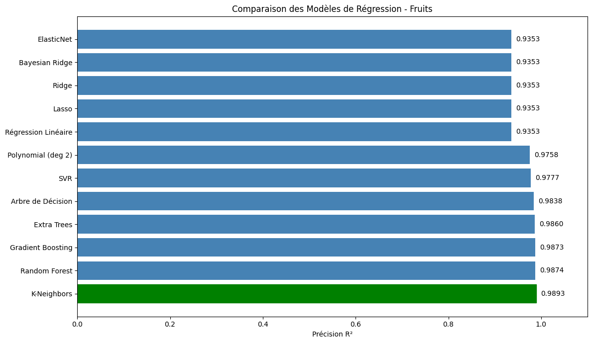
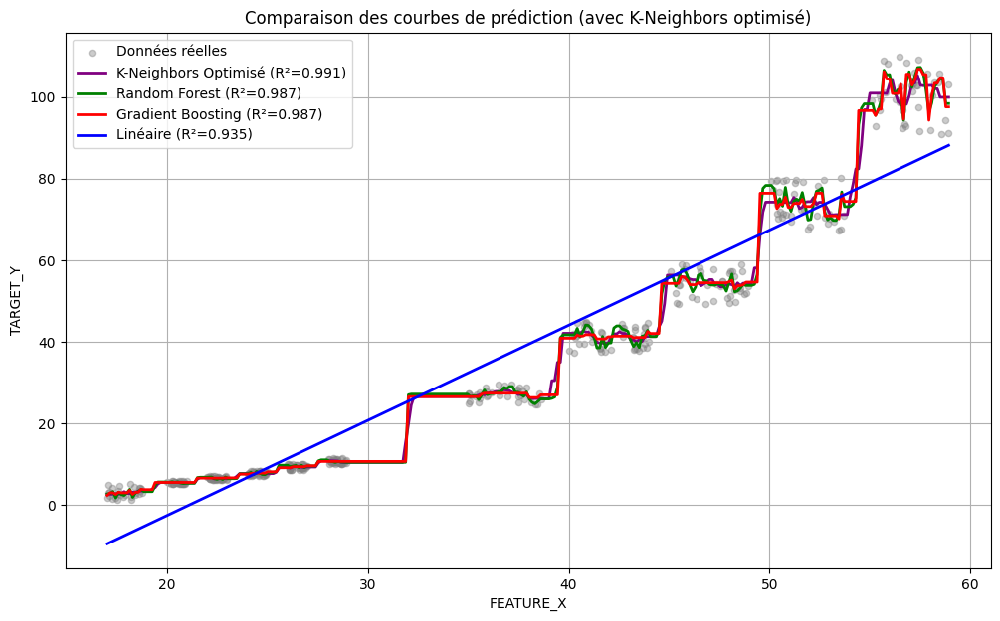
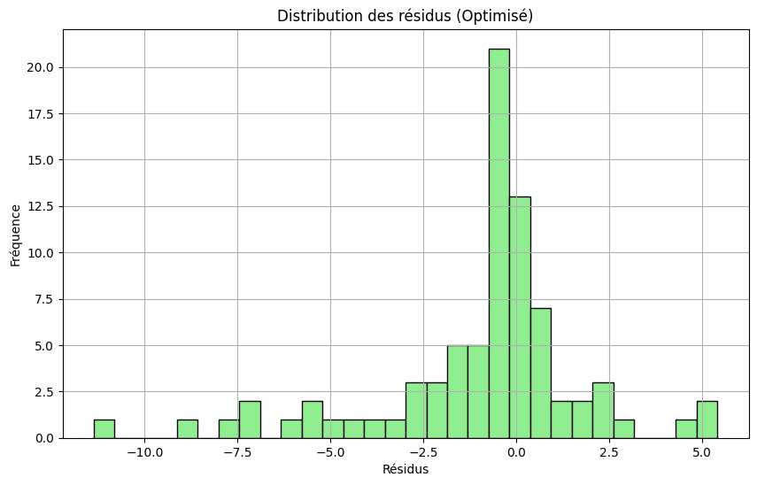
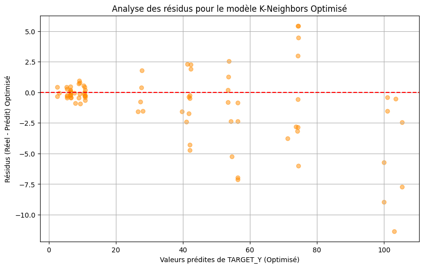
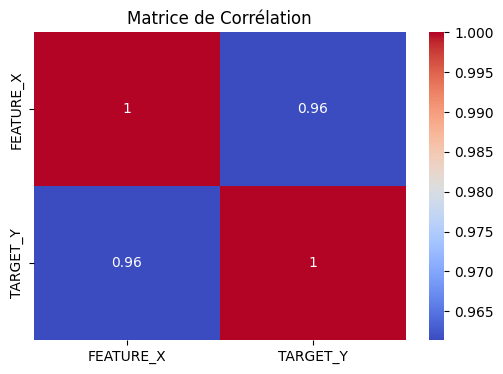

# DEVOIRE / Fruit MLOps v2 — Machine Learning & Deep Learning avec interface complète

tp :: Système complet de classification de fruits et de prédiction de prix : comparaison **Machine Learning vs Deep Learning** (régression logistique, Random Forest, réseau de neurones MLP), interface web interactive, monitoring de dérive des données, ré-entraînement en un clic.

##  Étude complète sur Google Colab (12 modèles de régression)

 ##  Notebook Colab accès direct : [Ouvrir l'étude dans Google Colab](https://colab.research.google.com/drive/1MS6kuIdoUY-aSeHIE03FR65ErxHEE055#scrollTo=zOKAnI8Co0H9)

**12 algorithmes de régression** entraînés et comparés pour prédire `TARGET_Y` à partir de `FEATURE_X`
(corrélation 0.96), avec optimisation d'hyperparamètres du meilleur modèle et analyse des résidus.

###  Classement des 12 modèles (R² sur le jeu de test)

| Rang | Modèle | R² | Observation |
|---|---|---|---|
|  1 | **K-Neighbors (optimisé)** | **0.9893 → 0.991** | Après optimisation des hyperparamètres (k, pondération) |
|  2 | Random Forest | 0.9874 | Ensembliste robuste |
| 3 | Gradient Boosting | 0.9873 | Ensembliste séquentiel |
| 4 | Extra Trees | 0.9860 | |
| 5 | Arbre de décision | 0.9838 | |
| 6 | SVR | 0.9777 | |
| 7 | Polynomial (deg 2) | 0.9758 | |
| 8-12 | Linéaire, Lasso, Ridge, Bayesian Ridge, ElasticNet | 0.9353 | Les modèles linéaires plafonnent : la relation est **en escalier**, pas linéaire |

###  Pourquoi les modèles non-linéaires gagnent =

La donnée suit une **structure en escalier** que la régression linéaire (bleu) ne peut pas suivre,
alors que K-Neighbors, Random Forest et Gradient Boosting épousent chaque palier :

###  Diagnostic du modèle retenu (K-Neighbors optimisé)

Analyse des résidus : centrés sur zéro, sans biais systématique — l'erreur augmente
légèrement pour les grandes valeurs (hétéroscédasticité visible au-delà de 80) :

| Distribution des résidus | Résidus vs valeurs prédites |
|---|---|
|  |  |

###  Corrélation des variables

---

## Fonctionnalités de l'application

## 1 Prédiction interactive
Réglez 6 caractéristiques mesurables (poids, diamètre, longueur, sucre °Brix, acidité pH, fermeté) avec des curseurs → le modèle identifie le fruit avec les **probabilités par classe** et estime son **prix au kilo** SELON regle au colab.

### ON A DE  Comparaison ML vs Deep Learning
Trois modèles entraînés et évalués sur les mêmes données (25 % de test, stratifié) :

| Modèle | Type | Accuracy | F1 macro |
|---|---|---|---|
| Régression logistique | ML linéaire (baseline) | 99.0 % | 99.0 % |
| Random Forest  | ML ensembliste | 100 % | 100 % |
| **Réseau de neurones MLP (64→32)** | **Deep Learning** | 100 % | 100 % |

- régression du prix : Gradient Boosting — **erreur moyenne ~320 Ar/kg, R² 0.95**
- graphiques générés à l'entraînement : **matrice de confusion, importance des features, courbe d'apprentissage**

###  Monitoring MLOps
- **Historique des prédictions** (persisté)
- **Détection de dérive** : compare la moyenne des entrées récentes aux statistiques d'entraînement (z-score > 2 = alerte) — si les fruits reçus ne ressemblent plus aux données d'entraînement, l'interface passe au rouge

## on peut faire  prédiction en lot aussi 
Upload d'un CSV (jusqu'à 10 000 lignes) → téléchargement du même fichier enrichi : fruit prédit, confiance, prix estimé.

##  ET Ré-entraînement en un clic
Bouton dans l'interface: régénère les données, ré-entraîne les 3 modèles, recharge en mémoire, met à jour les graphiques... ect

 [github.com/Stephen077j](https://github.com/Stephen077j)
