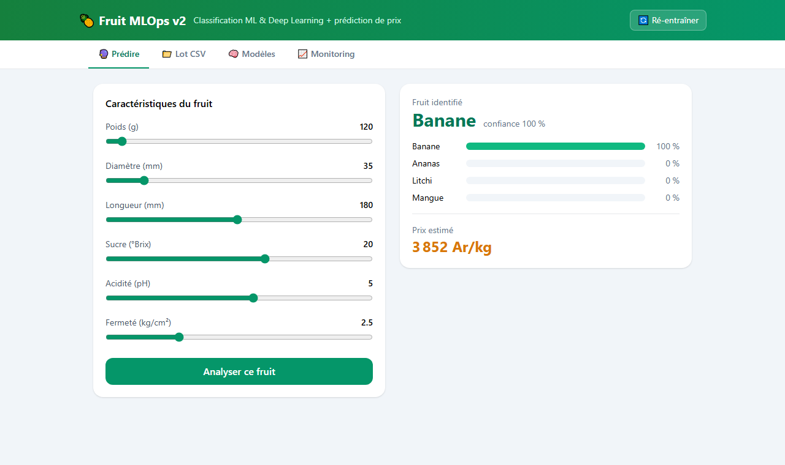
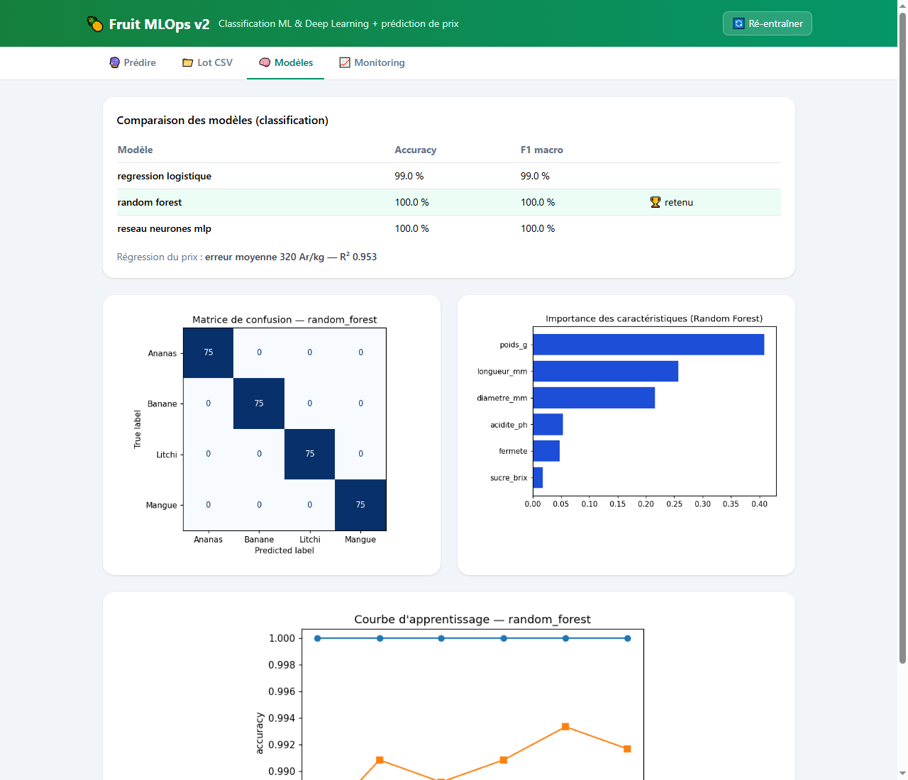
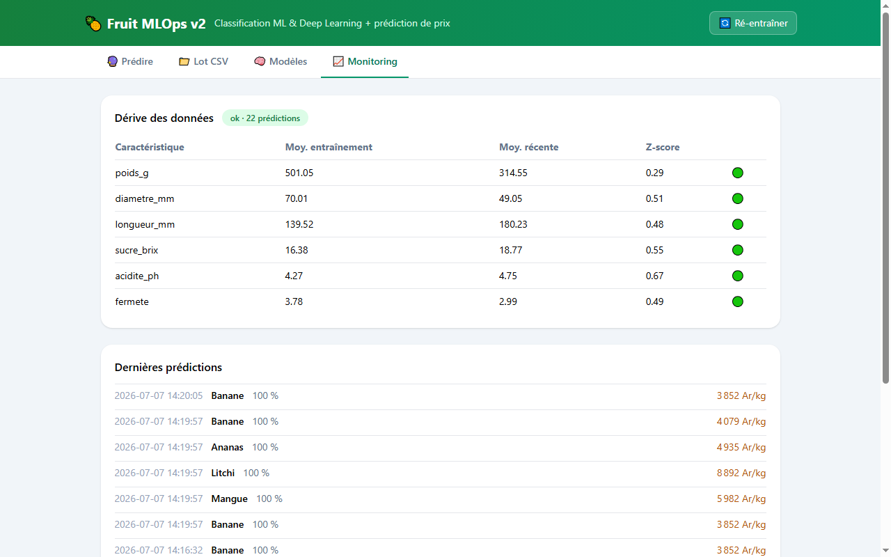

# 🍍 Fruit MLOps v2 — Machine Learning & Deep Learning avec interface complète

[](https://github.com/Stephen077j/ML/actions)


**FR** — Système complet de classification de fruits et de prédiction de prix : comparaison **Machine Learning vs Deep Learning** (régression logistique, Random Forest, réseau de neurones MLP), interface web interactive, monitoring de dérive des données, ré-entraînement en un clic.

**EN** — End-to-end fruit classification & price prediction system: **ML vs Deep Learning** comparison, interactive web UI, data-drift monitoring, one-click retraining.

---

## ✨ Fonctionnalités

### 🔮 Prédiction interactive
Réglez 6 caractéristiques mesurables (poids, diamètre, longueur, sucre °Brix, acidité pH, fermeté) avec des curseurs → le modèle identifie le fruit avec les **probabilités par classe** et estime son **prix au kilo**.



### 🧠 Comparaison ML vs Deep Learning
Trois modèles entraînés et évalués sur les mêmes données (25 % de test, stratifié) :

| Modèle | Type | Accuracy | F1 macro |
|---|---|---|---|
| Régression logistique | ML linéaire (baseline) | 99.0 % | 99.0 % |
| Random Forest 🏆 | ML ensembliste | 100 % | 100 % |
| **Réseau de neurones MLP (64→32)** | **Deep Learning** | 100 % | 100 % |

- régression du prix : Gradient Boosting — **erreur moyenne ~320 Ar/kg, R² 0.95**
- graphiques générés à l'entraînement : **matrice de confusion, importance des features, courbe d'apprentissage**



### 📈 Monitoring MLOps
- **Historique des prédictions** (persisté)
- **Détection de dérive** : compare la moyenne des entrées récentes aux statistiques d'entraînement (z-score > 2 = alerte) — si les fruits reçus ne ressemblent plus aux données d'entraînement, l'interface passe au rouge



### 📁 Prédiction en lot
Upload d'un CSV (jusqu'à 10 000 lignes) → téléchargement du même fichier enrichi : fruit prédit, confiance, prix estimé.

### 🔄 Ré-entraînement en un clic
Bouton dans l'interface (ou `POST /api/retrain`) : régénère les données, ré-entraîne les 3 modèles, recharge en mémoire, met à jour les graphiques.

## 🚀 Démarrage

```bash
git clone https://github.com/Stephen077j/ML.git
cd ML
pip install -r requirements.txt

cd ml && python train.py && cd ..     # entraîne les 3 modèles (~1 min)
uvicorn app:app --reload              # http://localhost:8000
```

### Docker

```bash
docker build -t fruit-mlops .
docker run -p 8000:8000 fruit-mlops
```

## 🧪 Tests

```bash
pytest -v   # 9 tests : prédictions, validation, CSV, graphiques, monitoring
```

## 🏗️ Architecture

```
ml/data.py ──► ml/train.py ──► artifacts/ (modèles + métriques + graphiques PNG)
                                   │
templates/index.html ◄── app.py (FastAPI) ── /api/predict · /api/predict-batch
     (4 onglets)                             /api/metrics · /api/monitoring
                                             /api/history · /api/retrain · /api/charts/*
```

## 📡 API (extrait)

```bash
curl -X POST http://localhost:8000/api/predict \
  -H "Content-Type: application/json" \
  -d '{"poids_g": 120, "diametre_mm": 35, "longueur_mm": 180,
       "sucre_brix": 20, "acidite_ph": 5.0, "fermete": 2.5}'
# → {"fruit": "Banane", "confiance": 1.0, "probabilites": {...}, "prix_estime_ar_kg": 3852}
```

Documentation interactive complète : http://localhost:8000/docs (Swagger)

---

**Joel Stephen** — Développeur Full-Stack & IA/ML
📧 bertin.andry@gmail.com · 🐙 [github.com/Stephen077j](https://github.com/Stephen077j)
